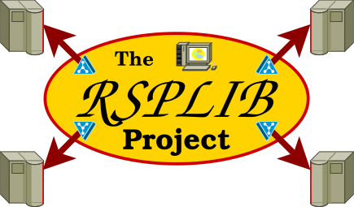
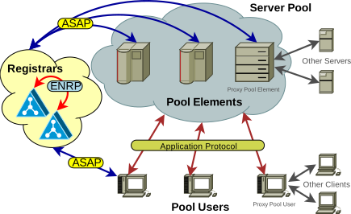
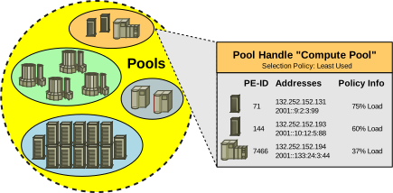
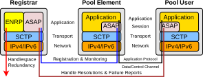

<h1 align="center">
 RSPLIB<br />
 <span style="font-size: 30%">The Reliable Server Pooling Implementation</span><br />
 <a href="https://www.nntb.no/~dreibh/rserpool/">
  <br />
  <span style="font-size: 30%;">https://www.nntb.no/~dreibh/rserpool</span>
 </a>
</h1>


# 💡 What is RSPLIB?

[Reliable Server Pooling&nbsp;(RSerPool)](#what-is-reliable-server-pooling-rserpool) is the new IETF framework for server pool management and session failover handling. In particular, it can be used for realising highly available services and load distribution. RSPLIB is the reference implementation of RSerPool. It includes:

* The library librsplib, which is the RSerPool implementation itself;
* The library libcpprspserver, which is a C++ wrapper library to easily write server applications based on librsplib;
* A collection of server (pool element) and client (pool user) examples.


# 💡 What is Reliable Server Pooling (RSerPool)?

## Introduction

The development and standardisation of an application-independent server pooling architecture has been set as the goal of the [IETF RSerPool&nbsp;WG](https://datatracker.ietf.org/wg/rserpool/about/). As a result, the working group has created their concept _Reliable Server Pooling_, abbreviated as RSerPool, which at the moment consists of eight RFCs, several Internet Drafts and RSPLIB as reference implementation.

## Requirements to the Reliable Server Pooling Architecture

As key requirements to the Reliable Server Pooling architecture, the following points has been identified in [RFC&nbsp;3237](https://www.rfc-editor.org/rfc/rfc3237.html):

* Lightweight:
  The RSerPool solution may not require a significant amount of resources (e.g.&nbsp;CPU power or memory). In particular, it should be possible to realize RSerPool-based systems also on low-power devices like mobile phones, PDAs and embedded devices.

* Real-Time:
  Real-time services like telephone signalling have very strict limitations on the duration of failovers. In the case of component failures, it may be necessary that a "normal" system state is re-established within a duration of just a few hundreds of milliseconds. In telephone signalling, such a feature is in particular crucial when dealing with emergency calls.

* Scalability:
  Providing services like distributed computing, it is necessary to manage pools of many hundreds or even thousands of servers (e.g.&nbsp;animation rendering pools). The RSerPool architecture must be able to efficiently handle such pools. But the amount and size of pools are limited to a company or organization. In particular, it is not a goal of RSerPool to handle the global Internet in one pool set.

* Extensibility:
  It must be possible to easily adapt the RSerPool architecture to future applications. In particular, this means to have the possibility to add new server selection procedures. That is, new applications can define special rules on which server of the pool is the most appropriate to use for the processing of a request (e.g.&nbsp;the least-used server). The configuration effort of RSerPool components (e.g.&nbsp;adding or removing servers) should be as small as possible. In the ideal case, the configuration should happen automatically, i.e.&nbsp;it should e.g.&nbsp;only be necessary to turn on a new server and it will configure automatically.

## The Reliable Server Pooling Architecture

<p align="center">
 <a href="src/figures/EN-RSerPool-Scenario-with-PPE.svg"></a><br />
 An RSerPool Scenario
</p>

The figure above shows the building blocks of the RSerPool architecture, which has been defined by the [IETF RSerPool&nbsp;WG](https://datatracker.ietf.org/wg/rserpool/about/) in [RFC&nbsp;5351](https://www.rfc-editor.org/rfc/rfc5351.html):. In the terminology of RSerPool a server is denoted as a _Pool Element_&nbsp;(PE). In its _Pool_, it is identified by its _Pool Element Identifier_&nbsp;(PE&nbsp;ID), a 32-bit number. The PE&nbsp;ID is randomly chosen upon a PE's registration to its pool. The set of all pools is denoted as the _Handlespace_. In older literature, it may be denoted as _Namespace_. This denomination has been dropped in order to avoid confusion with the [Domain Name System&nbsp;(DNS)](https://en.wikipedia.org/wiki/Domain_Name_System). Each pool in a handlespace is identified by a unique Pool Handle&nbsp;(PH), which is represented by an arbitrary byte vector. Usually, this is an ASCII or Unicode representation of the pool, e.g.&nbsp;"Compute Pool" or "Web Server Pool".

<p align="center">
 <a href="src/figures/EN-RSerPool-Handlespace-Information.svg"></a><br />
 A Handlespace Example
</p>

Each handlespace has a certain scope (e.g.&nbsp;an organization or company), which is denoted as _Operation Scope_. It is an explicit non-goal of RSerPool to manage the global Internet's pools within a single handlespace. Due to the limitation of operation scopes, it is possible to keep the handlespace "flat". That is, PHs do not have any hierarchy in contrast to the DNS with its top-level and sub-domains. This constraint results in a significant simplification of the handlespace management.

Within an operation scope, the handlespace is managed by redundant _Registrars_. In literature, this component is also denoted as _ENRP Server_ or _Name Server_. Since "registrar" is the most expressive term, this denotation is used here. PRs have to be redundant in order to avoid a PR to become a single point of failure&nbsp;(SPoF). Each PR of an operation scope is identified by its _Registrar ID_ (PR&nbsp;ID), which is a 32-bit random number. It is not necessary to ensure uniqueness of PR&nbsp;IDs. A PR contains a complete copy of the operation scope's handlespace. PRs of an operation scope synchronize their view of the handlespace using the **E**ndpoint Ha**N**dlespace **R**edundancy **P**rotocol&nbsp;(ENRP) defined in [RFC&nbsp;5353](https://www.rfc-editor.org/rfc/rfc5353.html). Older versions of this protocol use the term Endpoint Namespace Redundancy Protocol; this naming has been replaced to avoid confusion with DNS, but the abbreviation has been kept. Due to handlespace synchronization by ENRP, PRs of an operation scope are functionally equal. That is, if any of the PRs fails, each other PR is able to seamlessly replace it.

By using the **A**ggregate **S**erver **A**ccess **P**rotocol&nbsp;(ASAP), defined in [RFC&nbsp;5352](https://www.rfc-editor.org/rfc/rfc5352.html), a PE can add itself to a pool or remove it from by requesting a registration or deregistration from an arbitrary PR of the operation scope. In case of successful registration, the PR chosen for registration becomes the PE's _Home-PR_&nbsp;(PR-H). A PR-H not only informs the other PRs of the operation scope about the registration or deregistration of its PEs, it also monitors the availability of its PEs by ASAP Keep-Alive messages. A keep-alive message by a PR-H has to be acknowledged by the PE within a certain time interval. If the PE fails to answer within a certain timeout, it is assumed to be dead and immediately removed from the handlespace. Furthermore, a PE is expected to re-register regularly. At a re-registration, it is also possible for the PE to change its list of transport addresses or its policy information (to be explained later).

To use the service of a pool, a client – called _Pool User_&nbsp;(PU) in RSerPool terminology – first has to request the resolution of the pool's PH to a list of PE identities at an arbitrary PR of the operation scope. This selection procedure is denoted as _Handle Resolution_. For the case that the requested pool is existing, the PR will select a list of PE identities according to the pool's _Pool Member Selection Policy_, also simply denoted as _Pool Policy_. [RFC&nbsp;5356](https://www.rfc-editor.org/rfc/rfc5356.html) defines some standard pool policies.

Possible pool policies are e.g.&nbsp;a random selection (Random) or the least-loaded PE (Least Used). While in the first case it is not necessary to have any selection information (PEs are selected randomly), it is required to maintain up-to-date load information in the second case of selecting the least-loaded PE. By using an appropriate selection policy, it is e.g.&nbsp;possible to equally distribute the request load onto the pool's PEs.

After reception of a list of PE identities from a PR, a PU will write the PE information into its local cache. This cache is denoted as _PU-side Cache_. Out of its cache, the PU will select exactly one PE – again by applying the pool's selection policy – and establish a connection to it by using the application's protocol, e.g.&nbsp;HTTP over SCTP or TCP in case of a web server. Over this connection, the service provided by the server can be used. For the case that the establishment of the connection fails or the connection is aborted during service usage, a new PE can be selected by repeating the described selection procedure. If the information in the PU-side cache is not outdated, a PE identity may be directly selected from cache, skipping the effort of asking a PR for handle resolution. After re-establishing a connection with a new PE, the state of the application session has to be re-instantiated on the new PE. The procedure necessary for session resumption is denoted as _failover procedure_ and is of course application-specific. For an FTP download for example, the failover procedure could mean to tell the new FTP server the file name and the last received data position. By that, the FTP server will be able to resume the download session. Since the failover procedure is highly application-dependent, it is not part of RSerPool itself, though RSerPool provides far-reaching support for the implementation of arbitrary failover schemes by its Session Layer mechanisms.

To make it possible for RSerPool components to configure automatically, PRs can announce themselves via UDP over IP multicast. These announces can be received by PEs, PUs and other PRs, allowing them to learn the list of PRs currently available in the operation scope. The advantage of using IP multicast instead of broadcast is that this mechanism will also work over routers (e.g.&nbsp;LANs connected via a VPN) and the announces will – for the case of e.g.&nbsp;a switched Ethernet – only be heard and processed by stations actually interested in this information. For the case that IP multicast is not available, it is of course possible to statically configure PR addresses.

## A Migration Path for Legacy Applications

RSerPool is a completely new protocol framework. To make it possible for existing specialized or proprietary server pooling solutions to iteratively migrate to an RSerPool-based solution, it is mandatory to provide a migration path. For clients without support for RSerPool, the RSerPool concept provides the possibility of a _Proxy PU_&nbsp;(PPU). A PPU handles requests of non-RSerPool clients and provides an intermediation instance between them and the RSerPool-based server pool. From a PE's perspective, PPUs behave like regular PUs. Similar to a PPU allowing the usage of a non-RSerPool client, it is possible to use a _Proxy PE_&nbsp;(PPE) to continue using a non-RSerPool server in an RSerPool environment.

## The Protocol Stack

<p align="center">
 <a href="src/figures/EN-RSerPool-ProtocolStack.svg"></a><br />
 The RSerPool Protocol Stack
</p>

The figure above shows the protocol stack of PR, PE and PU. The ENRP protocol is only used for the handlespace synchronization between PRs, all communications between PE and PR (registration, re-registration, deregistration, monitoring) and PU and PR (handle resolution, failure reporting) is based on the ASAP protocol. The failover support, based on an optional Session Layer between PU and PE, is also using ASAP. In this case, the ASAP protocol data (Control Channel) is multiplexed with the application protocol's data (Data Channel) over the same connection. By using the Session Layer functionality of ASAP, a pool can be viewed as a single, highly available server from the PU's Application Layer perspective. Failure detection and handling is mainly handled automatically in the Session Layer, transparent for the Application Layer.

The transport protocol used for RSerPool is usually SCTP, defined in [RFC&nbsp;9260](https://www.rfc-editor.org/rfc/rfc9260.html). The important properties of SCTP requiring its usage instead of TCP are the following:

* Multi-homing and path monitoring by Heartbeat messages for improved availability and verification of transport addresses,

* Dynamic Address Reconfiguration (Add-IP, see [RFC&nbsp;5061](https://www.rfc-editor.org/rfc/rfc5061.html)) to enable mobility and interruption-free address changes (e.g.&nbsp;adding a new network interface for enhanced redundancy),

* Message framing for simplified message handling (especially for the Session Layer),

* Security against blind flooding attacks by 4-way handshake and verification tag, and

* Protocol identification by [Payload Protocol Identifier&nbsp;(PPID)](https://www.iana.org/assignments/sctp-parameters/sctp-parameters.xhtml) for protocol multiplexing (required for the ASAP Session Layer functionality).

For the transport of PR announces by ASAP and ENRP via IP multicast, UDP is used as transport protocol. The usage of SCTP is mandatory for all ENRP communication between PRs and the ASAP communication between PEs and PRs. For the ASAP communication between PU and PR and the Session Layer communication between PE and PU, it is recommended to use SCTP. However, the usage of TCP together with an adaptation layer defined in [draft-ietf-rserpool-tcpmapping](https://datatracker.ietf.org/doc/html/draft-ietf-rserpool-tcpmapping-03) is possible. This adaptation layer adds functionalities like Heartbeats, message framing and protocol identification on top of a TCP connection. But nevertheless, some important advantages of SCTP are missing – especially the high immunity against flooding attacks and the multi-homing property. The only meaningful reason to use TCP is when the PU implementation cannot be equipped with an SCTP stack, e.g.&nbsp;when using a proprietary embedded system providing only a TCP stack.

## Further Details

A detailed introduction to RSerPool, including some application scenario examples, can be found in Chapter&nbsp;3 of «[Reliable Server Pooling – Evaluation, Optimization and Extension of a Novel IETF Architecture](https://duepublico2.uni-due.de/servlets/MCRFileNodeServlet/duepublico_derivate_00016326/Dre2006_final.pdf#chapter.3)»!


# 📦 Binary Package Installation

Please use the issue tracker at [https://github.com/dreibh/rsplib/issues](https://github.com/dreibh/rsplib/issues) to report bugs and issues!

## Ubuntu Linux

For ready-to-install Ubuntu Linux packages of RSPLIB, see [Launchpad PPA for Thomas Dreibholz](https://launchpad.net/~dreibh/+archive/ubuntu/ppa/+packages?field.name_filter=rsplib&field.status_filter=published&field.series_filter=)!

<pre>
sudo apt-add-repository -sy ppa:dreibh/ppa
sudo apt-get update
sudo apt-get install rsplib
</pre>

## Fedora Linux

For ready-to-install Fedora Linux packages of RSPLIB, see [COPR PPA for Thomas Dreibholz](https://copr.fedorainfracloud.org/coprs/dreibh/ppa/package/rsplib/)!

<pre>
sudo dnf copr enable -y dreibh/ppa
sudo dnf install rsplib
</pre>

## FreeBSD

For ready-to-install FreeBSD packages of RSPLIB, it is included in the ports collection, see [FreeBSD ports tree index of net/rsplib/](https://cgit.freebsd.org/ports/tree/net/rsplib/)!

<pre>
pkg install rsplib
</pre>

Alternatively, to compile it from the ports sources:

<pre>
cd /usr/ports/net/rsplib
make
make install
</pre>


# 💾 Build from Sources

RSPLIB is released under the [GNU General Public Licence&nbsp;(GPL)](https://www.gnu.org/licenses/gpl-3.0.en.html#license-text).

Please use the issue tracker at [https://github.com/dreibh/rsplib/issues](https://github.com/dreibh/rsplib/issues) to report bugs and issues!

## Development Version

The Git repository of the RSPLIB sources can be found at [https://github.com/dreibh/rsplib](https://github.com/dreibh/rsplib):

<pre>
git clone https://github.com/dreibh/rsplib
cd rsplib
cmake .
make
</pre>

Contributions:

* Issue tracker: [https://github.com/dreibh/rsplib/issues](https://github.com/dreibh/rsplib/issues).
  Please submit bug reports, issues, questions, etc. in the issue tracker!

* Pull Requests for RSPLIB: [https://github.com/dreibh/rsplib/pulls](https://github.com/dreibh/rsplib/pulls).
  Your contributions to RSPLIB are always welcome!

* CI build tests of RSPLIB: [https://github.com/dreibh/rsplib/actions](https://github.com/dreibh/rsplib/actions).

* Coverity Scan analysis of RSPLIB: [https://scan.coverity.com/projects/dreibh-rsplib](https://scan.coverity.com/projects/dreibh-rsplib).

## Release Versions

See [https://www.nntb.no/~dreibh/rsplib/#current-stable-release](https://www.nntb.no/~dreibh/rsplib/#current-stable-release) for release packages!


# 🗃️ First Steps

## Ensure that multicast is working!

You need a configured network interface with:

* at least a private address (192.168.*x*.*y*; 10.*a*.*b*.*c*; 172.16.*n*.*m* - 172.31.*i*.*j*)
* having the multicast flag set (e.g. ```sudo ifconfig <dev> multicast```)

In a typical network setup, this should already be configured.

Ensure that your firewall settings allow UDP packets to/from the registrar (ASAP Announce/ENRP Presence), as well as ASAP/ENRP traffic over SCTP.

## Start at least one registrar

```
rspregistrar
```

See [Registrar](#registrar) for registrar parameters.

## Start at least one pool element

```
rspserver -echo
```

You can start multiple pool elements; they may also run on different hosts, of course. If it complains about finding no registrar, check the multicast settings!

## Start a pool user

```
rspterminal
```

If it complains about finding no registrar, check the multicast settings!
Now, you have to manually enter some text lines on standard input.

## Testing a failover

If everything works, you can test RSerPool functionality by stopping the pool element and watching the failover.

## Monitor the component status

You can monitor the status of each component using the Component Status Protocol monitor "cspmonitor". Simply start it by ```cspmonitor```. It will listen for status messages sent via UDP on port&nbsp;2960. The components (registrar, rspserver, etc.) accept the command line arguments ```-cspserver=<server>:<port>``` and ```-cspinterval=<milliseconds>```. For example, if you want a status update every 300&nbsp;ms and your CSP client is listening on port 2960 of host 192.168.11.22, use the arguments
```
... -cspserver=192.168.11.22:2960 -cspinterval=300
```

Note: You *must* specify address **and** interval, otherwise no messages are sent.

## Run Wireshark

You can use [Wireshark](https://www.wireshark.org) to observe the RSerPool and demo protocol traffic. Coloring rules and filters can be found in the directory <tt>[rsplib/src/wireshark](https://github.com/dreibh/rsplib/tree/master/src/wireshark)</tt>. Simply copy <tt>[colorfilters](https://github.com/dreibh/rsplib/blob/master/src/wireshark/colorfilters)</tt>, <tt>[dfilters](https://github.com/dreibh/rsplib/blob/master/src/wireshark/dfilters)</tt> and optionally <tt>[preferences](https://github.com/dreibh/rsplib/blob/master/src/wireshark/preferences)</tt> to <tt>$HOME/.wireshark</tt>. Dissectors for the RSerPool and application protocols are already included in recent Wireshark distributions!


# 📚 Pool Elements (Servers)

All demo PE services can be started using the ```rspserver``` program. That is:

<pre>
rspserver &lt;options&gt; ...
</pre>

It takes a set of common parameters as well as some service-specific arguments. These parameters are explained in the following.

Notes:

* For most of the provided services, the latest version of [Wireshark](https://www.wireshark.org) already includes the packets dissectors!
* See the [manpage of "rspserver"](https://github.com/dreibh/rsplib/blob/master/src/rspserver.1) for further options!

  <pre>
  man rspserver
  </pre>


## Common Parameters

```rspserver``` provides some common options for all services:

* ```-loglevel=0-9```: Sets the logging verbosity from 0 (none) to 9 (very verbose).
* ```-logcolor=on|off```: Turns ANSI colorization of the logging output on or off.
* ```-logfile=<filename>```: Writes logging output to a file (default is stdout).
* ```-poolhandle=<poolhandle>```: Sets the PH to a non-default value; otherwise, the default setting will be the service-specific default (see below).
* ```-cspserver=<address>:<port>```: See [Component Status Protocol](#component-status-protocol) below).
* ```-cspinterval=<milliseconds>```: See [Component Status Protocol](#component-status-protocol) below).
* ```-registrar=<address>:<port>```: Adds a static PR entry into the Registrar Table. It is possible to add multiple entries.
* ```-asapannounce=<address>:<port>```: Sets the multicast address and port the ASAP instance listens for ASAP Server Announces on.
* ```-rereginterval=<milliseconds>```: Sets the PE's re-registration interval (in milliseconds).
* ```-runtime=<seconds>```: After the configured amount of seconds, the service is shut down.
* ```-quiet```: Do not print startup and shutdown messages.
* ```-policy=<policy>```: Sets the pool policy and its parameters:
  - ```Random```
  - ```WeightedRandom:<weight>```
  - ```RoundRobin```
  - ```WeightedRoundRobin:<weight>```
  - ```LeastUsed```
  - ```LeastUsedDegradation:<degradation>```
  - ...


## Echo Service

```-echo```: Selects Echo service. The default PH will be "EchoPool".

Note: The Echo Service will be started by default, unless a different service is specified!

Example:

<pre>
rspserver -echo -poolhandle=MyEchoPool
</pre>


## Discard Service

```-discard```: Selects Discard service. The default PH will be "DiscardPool".

Example:

<pre>
rspserver -discard -poolhandle=MyDiscardPool
</pre>


## Daytime Service

```-daytime```: Selects Daytime service. The default PH will be "DaytimePool".

Example:

<pre>
rspserver -daytime -poolhandle=MyDaytimePool
</pre>


## Character Generator Service

```-chargen```: Selects Character Generator service. The default PH will be "CharGenPool".

Example:

<pre>
rspserver -chargen -poolhandle=MyCharGenPool
</pre>


## Ping Pong Service

```-pingpong```: Selects Ping Pong service. The default PH will be "PingPongPool".

The Ping Pong service provides further options:

* ```-pppfailureafter=<number_of_messages>```: After the set number of messages, the server will terminate the connection in order to test failovers.
* ```-pppmaxthreads=<threads>```: Sets the maximum number of simultaneous sessions.

Example:

<pre>
rspserver -pingpong -poolhandle=MyPingPongPool -pppmaxthreads=4 -pppmaxthreads=8
</pre>


## Fractal Generator Service

```-fractal```: Selects the Fractal Generator service. The default PH will be "FractalGeneratorPool".

The Fractal Generator service provides further options:

* ```-fgpcookiemaxtime=<milliseconds>```: Send cookie after given number of milliseconds.
* ```-fgpcookiemaxpackets=<numner_of_messages>```: Send cookie after given number of Data messages.
* ```-fgptransmittimeout=<milliseconds>```: Set transmit timeout in milliseconds (timeout for rsp_sendmsg()).
* ```-fgptestmode```: Generate simple test pattern instead of calculating a fractal graphics (useful to conserve CPU power).
* ```-fgpfailureafter=<number_of_messages>```: After the set number of Data messages, the server will terminate the connection in order to test failovers.
* ```-fgpmaxthreads=<threads>```: Sets the maximum number of simultaneous sessions.

Example:

<pre>
rspserver -fractal -fgpmaxthreads=4
</pre>


## Calculation Application Service

```-calcapp```: Selects the Calculation Application (CalcApp) service. The default PH will be "CalcAppPool".

Details about the CalcApp service can be found in Chapter&nbsp;8 of «[Reliable Server Pooling – Evaluation, Optimization and Extension of a Novel IETF Architecture](https://duepublico2.uni-due.de/servlets/MCRFileNodeServlet/duepublico_derivate_00016326/Dre2006_final.pdf#chapter.8)»!
The CalcApp service provides further options:

* ```-capcapacity=<calculations_per_second>```: Sets the service capacity in calculations per second.
* ```-capcleanshutdownprobability=<probability>```: Sets the probability for sending state cookies to all sessions before shutting down.
* ```-capcookiemaxcalculations=<calculations>```: Sets the cookie interval in calculations.
* ```-capcookiemaxtime=<seconds>```: Sets the cookie interval in seconds.
* ```-capkeepalivetransmissioninterval=<milliseconds>```: Sets the keep-alive transmission interval in milliseconds.
* ```-capkeepalivetimeoutinterval=<milliseconds>```: Sets the keep-alive timeout in milliseconds.
* ```-capmaxjobs=<max_jobs>```: Sets the an upper limit for the number of simultaneous CalcApp requests.
* ```-capobject=<name>```: Sets the object name for scalar hierarchy.
* ```-capscalar=<scalar_file>```: Sets the name of vector scalar file to write.
* ```-capvector=<vector_file>```: Sets the name of vector output file to write.

Example:

<pre>
rspserver -calcapp -capcapacity=2000000 -capmaxjobs=8
</pre>


# 📚 Pool Users (Clients)

## Common Parameters

The pool users provides some common options for all programs:

* ```-loglevel=0-9```: Sets the logging verbosity from 0 (none) to 9 (very verbose).
* ```-logcolor=on|off```: Turns ANSI colorization of the logging output on or off.
* ```-logfile=<filename>```: Writes logging output to a file (default is stdout).
* ```-poolhandle=<poolhandle>```: Sets the PH to a non-default value; otherwise, the default setting will be the service-specific default (see below).
* ```-cspserver=<address>:<port>```: See [Component Status Protocol](#component-status-protocol) below).
* ```-cspinterval=<milliseconds>```: See [Component Status Protocol](#component-status-protocol) below).
* ```-registrar=<address>:<port>```: Adds a static PR entry into the Registrar Table. It is possible to add multiple entries.


## Terminal Client

The PU for the
[Echo Service](#echo-service),
[Discard Service](#discard-service),
[Daytime Service](#daytime-service), or
[Character Generator Service](#character-generator-service)
can be started by:

<pre>
rspterminal &lt;options&gt; ...
</pre>

Input from standard input is sent to the PE, and the response is printed to standard output.

Example:

<pre>
rspterminal -poolhandle=MyDaytimePool
</pre>

Notes:

* The default PH is EchoPool. Use ```-poolhandle=<poolhandle>``` to set a different PH, e.g. "DaytimePool".
* See the [manpage of "rspterminal"](https://github.com/dreibh/rsplib/blob/master/src/rspterminal.1) for further options!
  <pre>
  man rspterminal
  </pre>


## Ping Pong Client

The PU for the [Ping Pong Service](#ping-pong-service) can be started by:

```
pingpongclient
```

The Ping Pong PU provides further options:

* ```-interval=<milliseconds>```: Sets the Ping interval in milliseconds.

Example:

<pre>
pingpongclient -poolhandle=MyPingPongPool -interval=333
</pre>

Note: See the [manpage of "pingpongclient"](https://github.com/dreibh/rsplib/blob/master/src/pingpongclient.1) for further options!

<pre>
man pingpongclient
</pre>


## Fractal Generator Client

The PU for the [Fractal Generator Service](#fractal-generator-service) can be started by:

<pre>
fractalpooluser &lt;options&gt; ...
</pre>

The Fractal Generator PU provides further options:

* ```-configdir=<directory>```: Sets a directory to look for FGP config files. From all FGP files (pattern: <tt>*.fgp</tt>) in this directory, random files are selected for the calculation of requests. The <tt>.fgp</tt> files can be created, read and modified by [FractGen](https://www.nntb.no/~dreibh/fractalgenerator/).
* ```-threads=<maximum_number_of_threads> ```: Sets the number of parallel sessions for the calculation of an image.
* ```-caption=<title>```: Sets the window title.

Example (assuming the [<tt>.fgp</tt> input files](https://github.com/dreibh/rsplib/tree/master/src/fgpconfig) are installed under <tt>/usr/share/fgpconfig</tt>):

<pre>
fractalpooluser -configdir=/usr/share/fgpconfig -caption="Fractal PU Demo!"
</pre>

Note: See the [manpage of "fractalpooluser"](https://github.com/dreibh/rsplib/blob/master/src/fractalpooluser.1) for further options!

<pre>
man fractalpooluser
</pre>


## Calculation Application Client

The PU for the [Calculation Application Service](#calculation-application-service) (CalcApp) can be started by:

```
calcappclient
```

The CalcApp PU provides further options:

* ```-jobinterval=<seconds>```: Sets the job interval in seconds.
* ```-jobsize=<calculations>```: Sets the job size in calculations.
* ```-keepalivetransmissioninterval=<milliseconds>```: Sets the session keep-alive interval in milliseconds.
* ```-keepalivetimeoutinterval=<milliseconds>```: Sets the session keep-alive timeout in milliseconds.
* ```-object=<name>```: Sets the object name for scalar hierarchy.
* ```-runtime=<seconds>```: After the configured number of seconds, the service is shut down. Floating-point values (e.g.&nbsp;30.125) are possible.
* ```-scalar=<scalar_file>```: Sets the name of vector scalar file to write.
* ```-vector=<vector_file>```: Sets the name of vector output file to write.

Example:

<pre>
calcappclient -jobinterval=30.125 -jobsize=5000000
</pre>

Notes:

* Details about the CalcApp service can be found in Chapter&nbsp;8 of «[Reliable Server Pooling – Evaluation, Optimization and Extension of a Novel IETF Architecture](https://duepublico2.uni-due.de/servlets/MCRFileNodeServlet/duepublico_derivate_00016326/Dre2006_final.pdf#chapter.8)»!
* See the [manpage of "calcappclient"](https://github.com/dreibh/rsplib/blob/master/src/calcappclient.1) for further options!

  <pre>
  man calcappclient
  </pre>


# 📚 Registrar

Start the registrar with:

<pre>
rspregistrar &lt;options&gt; ...
</pre>


## Basic Parameters

* ```-loglevel=0-9```: Sets the logging verbosity from 0 (none) to 9 (very verbose).
* ```-logcolor=on|off```: Turns ANSI colorization of the logging output on or off.
* ```-logfile=<filename>```: Writes logging output to a file (default is stdout).
* ```-cspserver=<address>:<port>```: See [Component Status Protocol](#component-status-protocol) below).
* ```-cspinterval=<milliseconds>```: See [Component Status Protocol](#component-status-protocol) below).


## ASAP Parameters

* ```-asap=auto|<address>:<port>[<,address>]```: Sets the ASAP endpoint address(es). Use "auto" to automatically set it (default). Examples:
  - ```-asap=auto```
  - ```-asap=1.2.3.4:3863```
  - ```-asap=1.2.3.4:3863,[2000::1:2:3],9.8.7.6```

* ```-asapannounce=auto|<address>:<port>```: Sets the multicast address and UDP port to send the ASAP Announces to. Use "auto" for default. Examples:
  - ```-asapannounce=auto```
  - ```-asapannounce=239.0.0.1:3863```
* ```-maxbadpereports=<number_of_reports>```: Sets the maximum number of ASAP Endpoint Unreachable reports before removing a PE.
* ```-endpointkeepalivetransmissioninterval=<milliseconds>```: Sets the ASAP Endpoint Keep Alive interval.
* ```-endpointkeepalivetimeoutinterval=<milliseconds>```: Sets the ASAP Endpoint Keep Alive timeout.
* ```-serverannouncecycle=<milliseconds>```: Sets the ASAP Announce interval.
* ```-autoclosetimeout=<seconds>```: Sets the SCTP autoclose timeout for idle ASAP associations.
* ```-minaddressscope=<scope>```: Sets the minimum address scope acceptable for registered PEs:
  - ```loopback```: Loopback address (only valid on the same node!)
  - ```site-local```: Site-local addresses (e.g. 192.168.1.1, etc.)
  - ```global```: Global addresses
* ```-quiet```: Do not print startup and shutdown messages.


## ENRP Parameters

* ```-enrp=auto|<address>:<port>[<,address>]```: Sets the ENRP endpoint address(es). Use "auto" to automatically set it (default). Examples:
  - ```-enrp=auto```
  - ```-enrp=1.2.3.4:9901```
  - ```-enrp=1.2.3.4:9901,[2000::1:2:3],9.8.7.6```
* ```-enrpannounce=auto|<address>:<port>```: Sets the multicast address and UDP port to send the ENRP Announces to. Use "auto" for default. Examples:
  - ```-enrpannounce=auto```
  - ```-enrpannounce=239.0.0.1:9901```
* ```-peer=<address>:<port>```: Adds a static PR entry into the Peer List. It is possible to add multiple entries.
* ```-peerheartbeatcycle=<milliseconds>```: Sets the ENRP peer heartbeat interval.
* ```-peermaxtimelastheard=<milliseconds>```: Sets the ENRP peer max time last heard.
* ```-peermaxtimenoresponse=<milliseconds>```: Sets the ENRP maximum time without response.
* ```-takeoverexpiryinterval=<milliseconds>```: Sets the ENRP takeover timeout.
* ```-mentorhuntinterval=<milliseconds>```: Sets the mentor PR hunt interval.


## Further Parameters

Note: See the [manpage of "rspregistrar"](https://github.com/dreibh/rsplib/blob/master/src/rspregistrar.1) for further options!

<pre>
man rspregistrar
</pre>


# 📚 Component Status Protocol

The Component Status Protocol is a simple UDP-based protocol for RSerPool components to send their status to a central monitoring component. A console-based receiver is ./cspmonitor; it receives the status updates by
default on UDP port 2960.

In order to send status information, the registrar as well as all servers and clients described in section B provide two parameters:

* ```-cspserver=<address>:<port>```: Sets the CSP monitor server's address and port.
* ```-cspinterval=<milliseconds>```: Sets the interval for the CSP status updates in milliseconds.

Note: Both parameters **must** be provided in order to send status updates!


# 🖋️ Citing RSPLIB in Publications

RSPLIB and related BibTeX entries can be found in [AllReferences.bib](https://www.nntb.no/~dreibh/rserpool/bibtex/AllReferences.bib)!

[Dreibholz, Thomas](https://www.nntb.no/~dreibh/): «[Reliable Server Pooling – Evaluation, Optimization and Extension of a Novel IETF Architecture](https://duepublico2.uni-due.de/servlets/MCRFileNodeServlet/duepublico_derivate_00016326/Dre2006_final.pdf)» ([PDF](https://duepublico2.uni-due.de/servlets/MCRFileNodeServlet/duepublico_derivate_00016326/Dre2006_final.pdf), 9080&nbsp;KiB, 267&nbsp;pages, 🇬🇧), University of Duisburg-Essen, Faculty of Economics, Institute for Computer Science and Business Information Systems, URN&nbsp;[urn:nbn:de:hbz:465-20070308-164527-0](https://nbn-resolving.org/urn:nbn:de:hbz:465-20070308-164527-0), March&nbsp;7, 2007.


# 🔗 Useful Links

## RSerPool Introductions on Wikipedia in Different Languages

* 🇧🇦 [Bosnian](https://bs.wikipedia.org/wiki/Reliable_Server_Pooling) (thanks to Nihad Cosić)
* 🇨🇳 [Chinese](https://zh.wikipedia.org/wiki/Reliable_Server_Pooling) (thanks to Xing Zhou)
* 🇭🇷 [Croatian](https://hr.wikipedia.org/wiki/Reliable_Server_Pooling) (thanks to Nihad Cosić)
* 🇬🇧 [English](https://en.wikipedia.org/wiki/Reliable_server_pooling)
* 🇫🇷 [French](https://fr.wikipedia.org/wiki/Reliable_Server_Pooling)
* 🇩🇪 [German](https://de.wikipedia.org/wiki/Reliable_Server_Pooling) (thanks to Jobin Pulinthanath)
* 🇮🇹 [Italian](https://it.wikipedia.org/wiki/Reliable_server_pooling)
* 🇳🇴 [Norwegian (bokmål)](https://no.wikipedia.org/wiki/Reliable_Server_Pooling)

What about helping Wikipedia by adding an article in your language?

## Other Resources

* [NetPerfMeter – A TCP/MPTCP/UDP/SCTP/DCCP Network Performance Meter Tool](https://www.nntb.no/~dreibh/netperfmeter/index.html)
* [HiPerConTracer – High-Performance Connectivity Tracer](https://www.nntb.no/~dreibh/hipercontracer/index.html)
* [TSCTP – An SCTP test tool](https://www.nntb.no/~dreibh/tsctp/index.html)
* [_sctplib_ and _socketapi_ – The User-Space SCTP Library (_sctplib_) and Socket API Library (_socketapi_)](https://www.nntb.no/~dreibh/sctplib/index.html)
* [SubNetCalc – An IPv4/IPv6 Subnet Calculator](https://www.nntb.no/~dreibh/subnetcalc/index.html)
* [System-Tools – Tools for Basic System Management](https://www.nntb.no/~dreibh/system-tools/index.html)
* [Thomas Dreibholz's Multi-Path TCP (MPTCP) Page](https://www.nntb.no/~dreibh/mptcp/index.html)
* [Thomas Dreibholz's SCTP Page](https://www.nntb.no/~dreibh/sctp/index.html)
* [Michael Tüxen's SCTP page](https://www.sctp.de/)
* [Michael Tüxen's RSerPool page](https://www.sctp.de/rserpool.html)
* [NorNet – A Real-World, Large-Scale Multi-Homing Testbed](https://www.nntb.no/)
* [GAIA – Cyber Sovereignty](https://gaia.nntb.no/)
* [Wireshark](https://www.wireshark.org/)
